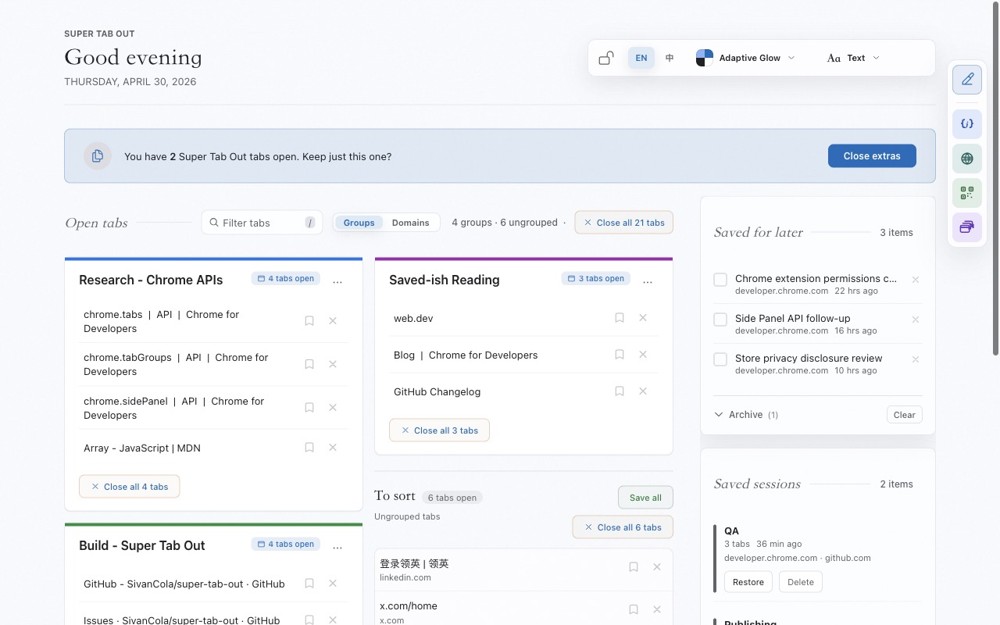
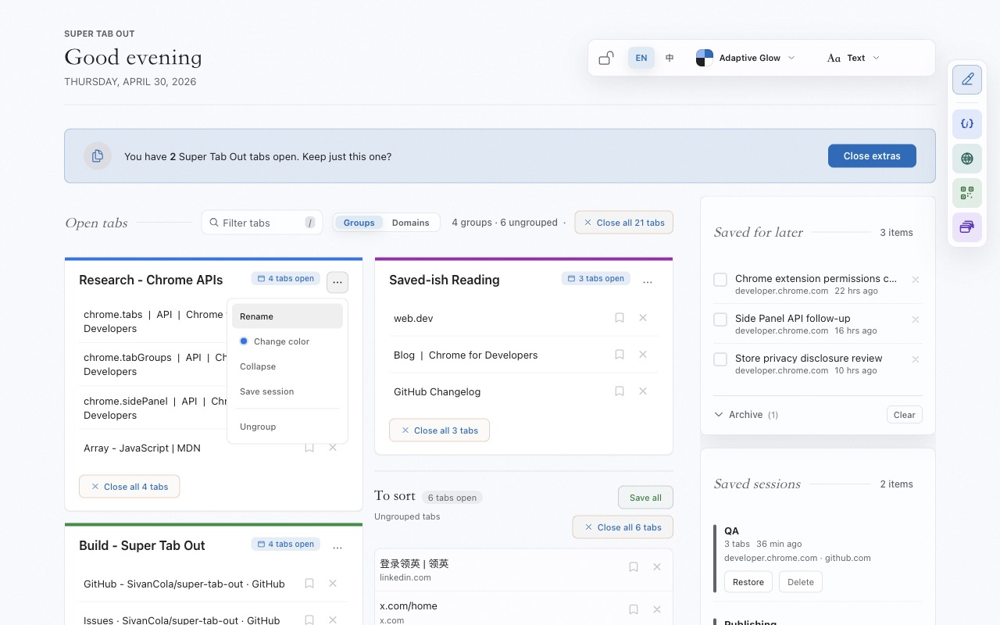
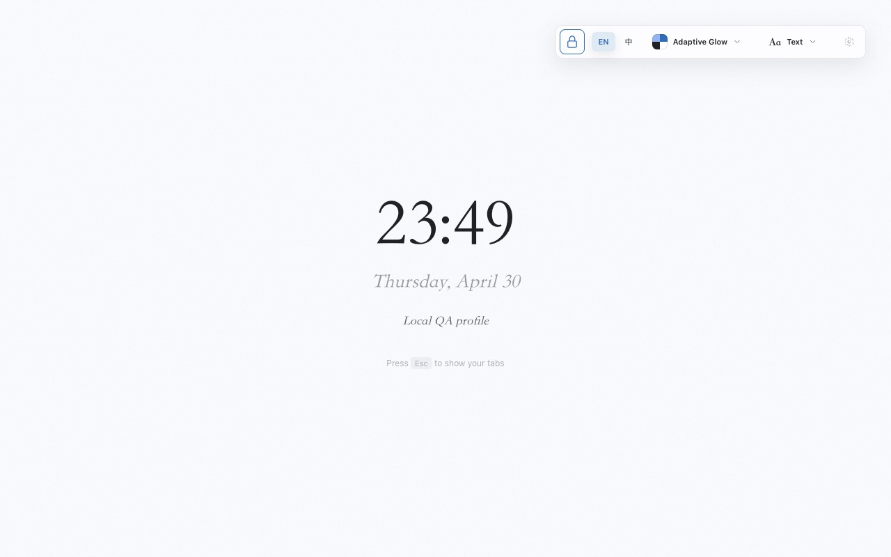
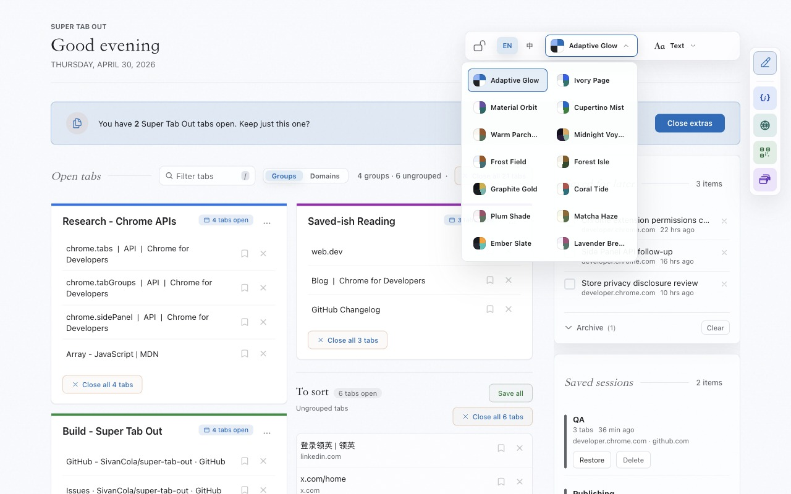
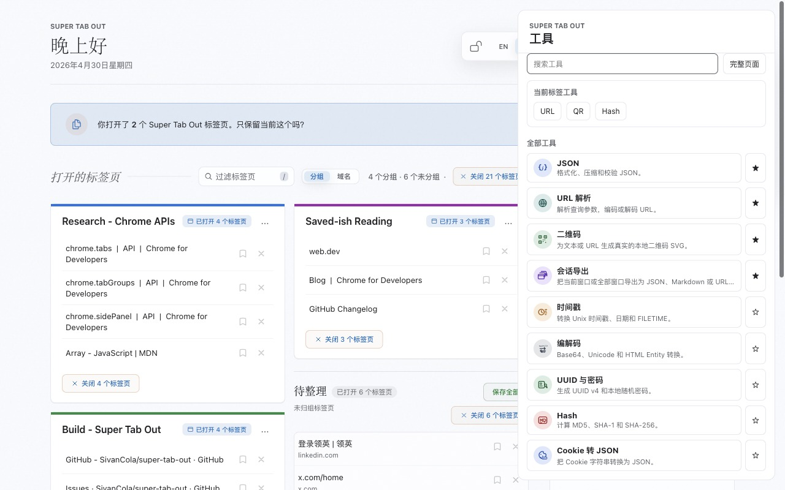

<div align="center">

<h1>Super Tab Out</h1>

<hr />

<h3>The Local-First New Tab Dashboard for Chrome, Edge & Brave</h3>

<p>
  
  
  
  
</p>

<p>
  English | <a href="./README.zh-CN.md">中文</a> | <a href="./CHANGELOG.md">Changelog</a>
</p>

</div>

**A polished local new-tab command center for Chromium browsers.**

Super Tab Out replaces the default new tab page with a visual dashboard for your open tabs. It groups tabs by domain or by Chrome Tab Groups, protects pinned tabs, gives you fast tab filtering, privacy mode, bilingual UI, and a richer theme picker.

No server. No account. No telemetry. No build step. Load the `extension/` folder and use it.

Release notes are tracked in [`CHANGELOG.md`](./CHANGELOG.md).

---

## Highlights

- **Text-first command desk**: a quieter new-tab layout with clear hierarchy, compact controls, and no decorative brand icon in the page header.
- **Two ways to organize tabs**: switch between domain grouping and Chrome's native Tab Groups.
- **Fast tab filtering**: press `/` and filter cards, chips, URLs, and group names in real time.
- **Search operators**: narrow results with `domain:`, `group:`, `url:`, and `saved:`; fuzzy matches are highlighted.
- **Side Panel command center**: search, jump, save, close, dedupe, restore recently closed tabs, and use local tools without leaving the current page.
- **Docked Command Center**: desktop layouts keep tools one click away with a compact dock and sortable favorite tools.
- **FeHelper-inspired local tools**: open a full three-column local tools workbench for JSON, URL parsing, codecs, timestamps, real QR SVGs, UUID/passwords, hashes, cookies, and session export.
- **Keyboard and omnibox entry points**: use `sto` in the address bar for search/actions, or commands for panel/session/privacy workflows.
- **Accessibility and motion controls**: icon buttons have accessible labels, chips support keyboard activation, and system reduced-motion preferences are respected.
- **Privacy mode for screen sharing**: click the lock or press `Esc` to hide the tab dashboard behind a clean clock screen.
- **Pinned tabs are protected**: pinned tabs are excluded from cards, counts, duplicate cleanup, and bulk-close actions.
- **One-click duplicate cleanup**: repeated URLs are marked and can be cleaned while keeping one copy.
- **Save for later**: stash a tab into a local checklist before closing it.
- **Auto-refresh**: tab open, close, navigation, and group changes refresh the dashboard automatically.
- **Bilingual UI**: switch between English and Simplified Chinese from the top-right control.
- **More themes, easier switching**: choose from 12 built-in palettes with a larger theme picker.
- **Local-first privacy posture**: settings and saved tabs stay on your machine.

---

## Screens and Controls



The page header keeps the product name, greeting, and date visible without showing an extra app icon. This keeps the new tab page clean while the browser extension icon remains available in Chrome or Edge UI.

The top-right controls are intentionally compact:

- **Lock**: toggles privacy mode.
- **EN / 中**: switches the fixed UI labels between English and Simplified Chinese.
- **Theme picker**: opens a palette menu with 12 themes.

Available themes:

| Theme | Tone |
| --- | --- |
| Warm paper | Soft editorial paper |
| Pure white | Minimal white workspace |
| Browser auto | Follows Chrome/Edge light or dark appearance |
| Midnight | Dark, quiet workspace |
| Arctic frost | Crisp blue-white |
| Forest canopy | Muted green and earth |
| Graphite gold | Dark graphite with gold accents |
| Coast coral | Coastal teal with coral |
| Plum studio | Low-saturation plum |
| Matcha desk | Calm green reading mode |
| Ember slate | Dark slate with warm energy |
| Lavender mint | Light lavender with mint |

Additional release screenshots:

| Chrome Groups | Privacy Mode |
| --- | --- |
|  |  |

| Theme Picker | Chinese UI |
| --- | --- |
|  |  |

---

## Install

1. Clone the repo:

```bash
git clone https://github.com/SivanCola/super-tab-out.git
cd super-tab-out
```

2. Open your browser extension page:

```text
chrome://extensions
edge://extensions
brave://extensions
```

3. Enable **Developer mode**.
4. Click **Load unpacked**.
5. Select the `extension/` folder in this repo.
6. Open a new tab.

To update later, pull the latest code and click **Reload** on the extension page:

```bash
git pull
```

---

## Debugging

For normal manual testing, use Chrome and load the `extension/` folder from `chrome://extensions`.

For automated extension testing, use **Chrome for Testing** instead of the regular branded Chrome app. Recent branded Chrome builds can block command-line unpacked-extension loading, while Chrome for Testing keeps that workflow available for automation.

This workspace can keep a local browser binary at:

```text
tools/chrome-for-testing/
```

That directory is intentionally ignored by Git because it is large and only needed for local debugging. It is not included in the Chrome Web Store / Edge Add-ons zip packages.

Launch the latest local extension build:

```bash
npm run dev:host
```

By default the script also prepares a repeatable manual regression scenario on every launch: pinned homepages, duplicate URLs, native Chrome Tab Groups, a collapsed group, mixed ungrouped tabs, a recently closed tab, saved-for-later items, saved sessions, activity metrics, achievements, and local tool favorites/state. It cleans previously seeded tabs before recreating the scenario, so repeated `npm run dev:host` runs do not stack duplicate seed tabs.

Use `scripts/launch-chrome-testing.sh --no-seed-tabs` for a clean browser, or `--reset-profile` for a fresh profile before seeding.

Optional overrides: `CHROME_BIN`, `PROFILE_DIR`, `REMOTE_DEBUGGING_PORT`, `SEED_TABS`, `SEED_DELAY_MS`, `SEED_CLEANUP`, and `SEED_REQUIRED`.

## Validation

No build step is required, but the repo includes lightweight local checks for extension changes:

```bash
node tests/run-tests.mjs
node scripts/validate-extension.mjs
```

The validator checks `manifest.json`, extension script syntax, service script loading order, and store ZIP contents for common local-only files.

---

## Keyboard Shortcuts

| Key | Action |
| --- | --- |
| `/` | Focus the open-tabs filter field |
| `Esc` while the filter is focused | Clear and blur the filter |
| `Esc` elsewhere | Toggle privacy mode |
| `Ctrl/Cmd + Shift + G` | Toggle Groups / Domains view |
| `Ctrl/Cmd + Shift + Y` | Open the Side Panel |

Omnibox keyword: type `sto` then a query or action such as `panel`, `save-session`, `dedupe`, or `privacy`.

---

## Feature Details

### Tab Dashboard

Super Tab Out reads your open tabs with `chrome.tabs.query({})`, filters out browser-internal pages, and renders useful cards:

- domain cards for normal browsing
- a Homepages card for landing pages like Gmail, X, YouTube, LinkedIn, and GitHub
- optional Chrome Tab Groups view
- duplicate badges for repeated URLs
- localhost labels with port numbers

### Search

The search pill uses one local index for open tabs, Chrome group titles, saved-for-later items, and saved sessions. Supported filters:

| Filter | Example |
| --- | --- |
| `domain:` | `domain:github auth` |
| `group:` | `group:work api` |
| `url:` | `url:docs extensions` |
| `saved:` | `saved:true article` or `saved:false github` |

### Side Panel

The Side Panel keeps Super Tab Out available while you stay on the current page:

- search open tabs, saved-for-later items, and saved sessions
- open the docked Command Center from the new-tab dashboard
- jump to a tab, save it for later, or close it
- clean duplicates while keeping one copy
- restore browser-level recently closed tabs/windows via `chrome.sessions`
- save the current browsing session
- view Tab Health, weekly stats, top domains, and achievements
- use a compact local tool directory with favorites, recent tools, current-tab URL shortcuts, and a link to the full Tools workbench

### Local Tools

The full Tools workbench is available from the Command Center and from omnibox entries such as `sto tool json`.

Initial tools are local-only: JSON format/minify/validate with tree preview and error diagnostics, URL parsing with query tables, Base64/Unicode/HTML entity codecs, timestamp and FILETIME conversion with cards, real QR SVG generation, UUID/password generation, MD5/SHA hashes, Cookie-to-JSON, and session export as JSON, Markdown, or URL lists.

### Chrome Tab Groups

Domain cards can create native Chrome Tab Groups. Group cards can be renamed, recolored, collapsed/expanded, ungrouped, or saved as a session. Saved sessions appear on the main dashboard and restore into the current window with the Chrome tab group rebuilt.

### Closing Behavior

The extension uses exact URL matching for close actions. This keeps bulk actions scoped to the tabs shown in the card and avoids closing unrelated pages on the same host.

Pinned tabs are skipped by every bulk-close and duplicate-cleanup action.

### Save for Later

The bookmark button saves a tab into `chrome.storage.local` before closing it. Saved items stay local and can be checked off into the archive.

### Privacy Mode

Privacy mode hides the tab dashboard and shows a minimal clock/date screen. It is useful before screen sharing or recording. You can customize whether the privacy screen shows:

- clock
- date
- custom text
- external favicon requests

### Themes and Language

Theme choice is stored in `localStorage` and applied before the page paints, so the selected theme does not flash back to the default on reload.

Language choice is also stored locally and applied early. The switch affects fixed UI labels only; tab titles, URLs, Chrome group names, and user-entered text are not translated or modified.

---

## Privacy

Super Tab Out is local-first.

Stored locally:

- saved-for-later tabs
- saved sessions
- lightweight activity stats and achievements
- privacy mode state and settings
- view mode
- language choice
- theme choice
- favicon cache

External favicon requests can be disabled from privacy settings. When disabled, cached favicons can still render, but new domains will not call the icon service.

The only routine external request, when enabled, is:

- `icons.duckduckgo.com` for favicons, cached locally for 7 days

No Google Fonts are used. Fonts come from system font stacks.

Privacy mode does not provide a web search box or change the browser search provider.

Store upload packages are generated into `dist/` only:

- `dist/super-tab-out-chrome-1.0.2.zip`
- `dist/super-tab-out-edge-1.0.2.zip`

---

## Permissions

The extension currently requests:

| Permission | Why it is needed |
| --- | --- |
| `tabs` | Read, focus, close, and group open tabs |
| `storage` | Persist saved tabs, sessions, stats, privacy settings, and view mode |
| `tabGroups` | Read, render, create, update, collapse, and ungroup Chrome Tab Groups |
| `sidePanel` | Show the Side Panel command center |
| `sessions` | Show and restore recently closed browser tabs/windows |

---

## Tech Stack

| Area | Implementation |
| --- | --- |
| Extension platform | Chrome Manifest V3 |
| UI | Plain HTML, CSS, JavaScript |
| Storage | `chrome.storage.local` and `localStorage` |
| Sound | Web Audio API |
| Animations | CSS transitions and JavaScript particles |
| Build | None |

Everything runs inside the extension page. The background service worker only keeps the toolbar badge count up to date.

---

## Attribution and License

Super Tab Out is licensed under the Apache License, Version 2.0.

This project is a derivative work based on **[Tab Out](https://github.com/zarazhangrui/tab-out)** by **Zara Zhang**, which is licensed under the MIT License.

The Apache-2.0 license text is in [`LICENSE`](./LICENSE). Required upstream MIT copyright and permission notices are preserved in [`NOTICE`](./NOTICE). Please do not remove those notices from substantial copies or distributions.

This fork adds security hardening, Manifest V3 updates, cross-browser new-tab handling, pinned-tab protection, Chrome Tab Groups view, bilingual UI, expanded theme support, privacy mode, tab filtering, favicon caching, and local-first saved-tab workflows.

This project is not affiliated with Google, Chrome, Microsoft Edge, Brave, DuckDuckGo, or the original Tab Out author. Product names and service names are used only to describe compatibility or attribution.

Apache-2.0. See [`LICENSE`](./LICENSE) and [`NOTICE`](./NOTICE).
